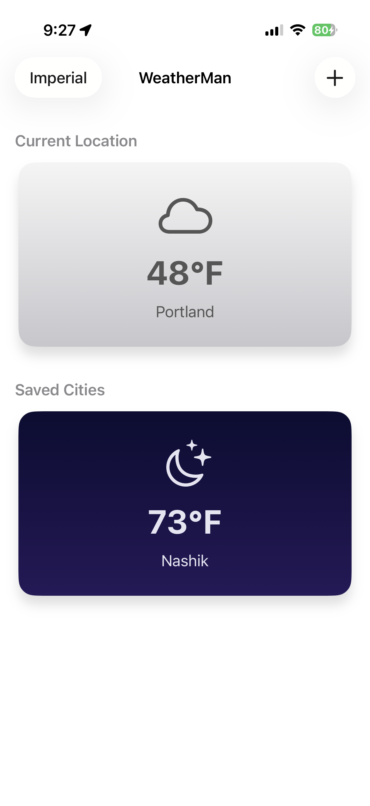
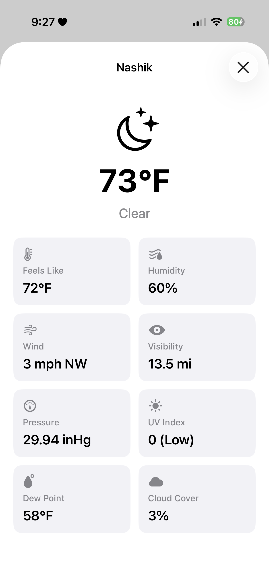
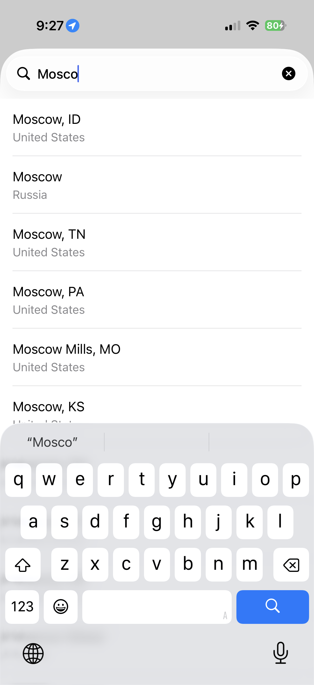
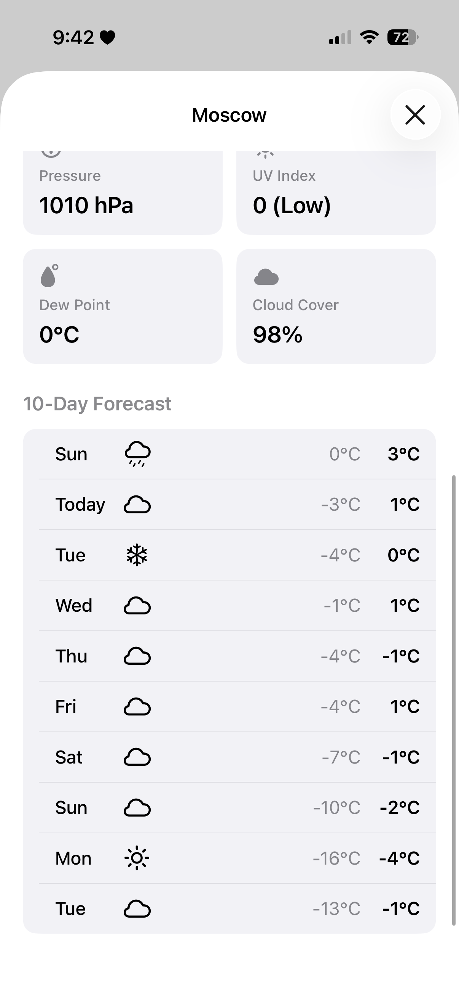

## WeatherMan

A simple UIKit app that displays current weather, allows the user to add their own cities, and presents detailed info to the user once a weather card is tapped. Uses WeatherKit, MapKit, and CoreLocation.

